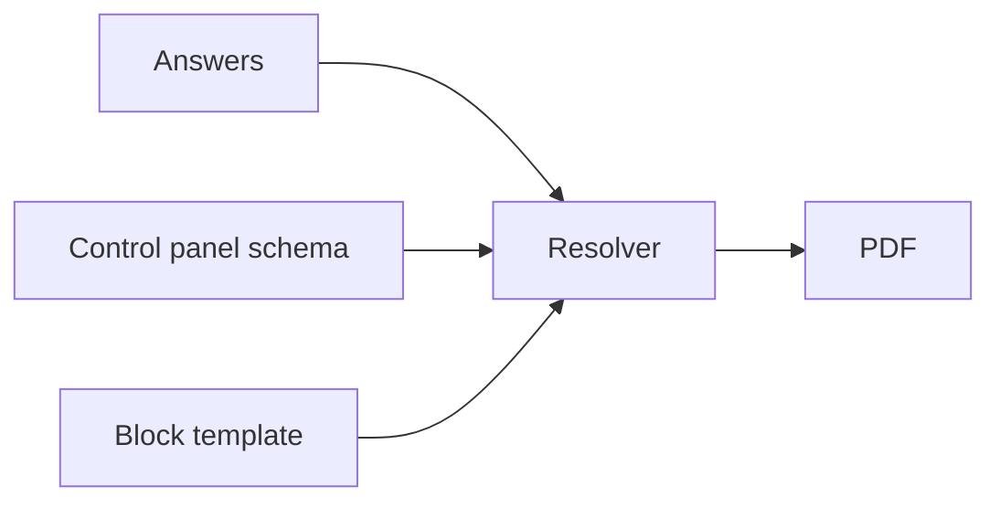
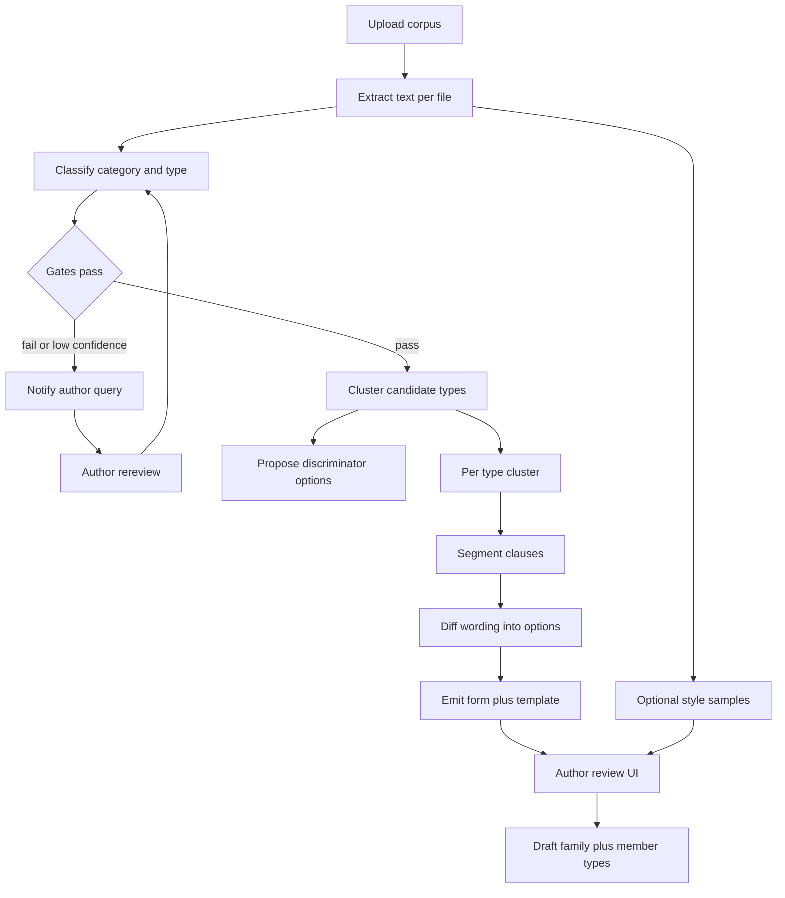

# Dynadoc: dynamic document / PDF creator

## Product

Dynadoc is a **multi-tenant document factory**. Each company (tenant) owns document **types** (e.g. “Employment contract”). A type is a **decision graph** (control panel) plus a **block template**. Operator answers resolve which inputs appear, which clauses render, and which wording is interpolated.

**Two renderings of the same resolved AST:**

- **Authoring / review** — block canvas and live preview. Structure, bindings, and branches are obvious. This is for building and checking the tree, not for looking like a law-firm PDF.
- **Issued document** — a **professional contract PDF** (and later `.docx` / other formats from the same AST): letterhead, logo, clause numbering, signature/initials blocks, party details, page chrome. It should read as a drawn-up agreement, not a form dump.

Word and other formats remain later exports of the same AST, not a second template language.

Two roles in v1:

- **Template author** — designs fields, branches, and clause bindings; publishes a version.
- **Operator** — fills the control panel and generates instances (PDFs) for people/deals.

Org admin (invite users, branding, later billing) sits on top.

## Core model (this is the product)

One **document type** is not a Word file with mail-merge. It is three layers that share the same answers:



1. **Control panel schema** — fields (dropdown, text, date, number, boolean, later repeatable groups) with **conditional visibility**. Choosing “Fixed-term” can replace the rest of the form with a different field set.
2. **Block template** — ordered document blocks (heading, paragraph, list, table, page break, signature). Each block (or span of wording) has **include-when** rules and **bindings** like `{{employee.fullName}}` or variant snippets keyed to an option.
3. **Resolver** — given answers, computes visible fields, interpolates text, drops/includes blocks, then hands the same resolved AST to (a) the review preview and (b) the **professional layout engine** (theme + PDF, later other file types).

The same expression language drives **field visibility** and **clause inclusion** so authors do not maintain two rule systems.

**Branching, not a linear form.** Model this as a **directed acyclic graph of field groups**, not a giant flat form. Each dropdown option can `activate` a child group (and deactivate siblings). Nested groups cover “this choice leads to a completely different set of inputs.” Cycles are forbidden; the resolver is a single topological pass.

**Wording variants.** Three binding styles, all first-class:

- **Interpolation** — `{{startDate}}` inside a shared paragraph.
- **Conditional block** — whole clause included when `employmentType == "permanent"`.
- **Variant map** — one slot, many texts: `jobTitle` → `{ "Engineer": "...", "Manager": "..." }` (this is what AI ingest will populate later).

## Data (Postgres)

Tenant isolation: `organization_id` on every business table. Prefer **Postgres Row Level Security** plus app-level checks.

Suggested entities:

- `organizations`, `memberships` (roles: `org_admin`, `author`, `operator`)
- `document_types` — name, status, current published version
- `document_type_versions` — immutable snapshot: `form_schema` JSON, `template` JSON, `style_theme` JSON, `expression` dialect version
- `instances` — answers JSON, resolved AST snapshot, issued-file storage keys (PDF first), created_by, created_at
- `assets` — logos, signature images, fonts (tenant + per-type branding)
- `notifications` — in-app inbox (and later email) for ingest gates, review requests, rereview loops
- `ingest_jobs` — corpus upload, classifier results, author decisions (accept cluster, exclude file, change category, re-run)

**Publish = freeze.** Operators always run against a **published version**. Authors edit a draft. Generating a contract stores the **version id + answers + resolved text** so wording cannot silently change under an already-issued PDF.

JSON schemas are versioned documents, not a web of SQL rows per field, so phase-2 AI can emit one tree or a **family of trees** as JSON and authors can diff/review it.

**Document family (phase 2, schema reserved now).** Similar types (employment vs contractor vs intern) are not forced into one mega-form. They group as a `document_family` with:

- a **discriminator** — the first decisive question(s) that route to a type (`agreementKind: employment | contractor | intern`)
- **member types** — each with its own form schema + template tree
- optional **shared field groups** (party names, company letterhead) referenced by members so common inputs are not rebuilt N times

v1 still creates standalone types. Families are a grouping + router on top of the same JSON; export/import should allow a bundle of types so AI output has a place to land.

### Form schema (sketch)

```ts
type FieldGroup = {
  id: string
  title: string
  visibleWhen?: Expr  // omitted = always, if parent is active
  fields: Field[]
}

type Field = {
  id: string
  type: "text" | "textarea" | "select" | "number" | "date" | "boolean"
  label: string
  required?: boolean
  options?: { value: string; label: string; activatesGroupIds?: string[] }[]
  visibleWhen?: Expr
}
```

### Template (sketch)

```ts
type Block = {
  id: string
  type: "heading" | "paragraph" | "list" | "table" | "pageBreak" | "signature" | "initials"
  includeWhen?: Expr
  children?: Inline[]  // text + bindings + variant maps
}

type StyleTheme = {
  page: { size: "A4" | "Letter"; margins: Margins }
  typography: { body: FontSpec; heading: FontSpec }
  letterhead: { logoAssetId?: string; headerHtml?: string; footerMode: "pageNumbers" | "letterhead" }
  signatures: { blocks: SignatureSlot[] }  // party name, title, date, image or wet-sign line
}
```

`style_theme` is what makes the **download** look professional. The block canvas does not have to look like the PDF; the layout engine applies theme + numbering + signature layout at issue time.

### Expressions

Start with a **small JSON AST** (equality, `in`, `and`/`or`/`not`, exists). Do not start with free-form JS. Authors get a rule builder UI; power users can see JSON. This stays safe for multi-tenant and is easy for AI to emit later.

## Stack (recommended)

| Layer | Choice | Why |
|---|---|---|
| App | **Next.js (App Router) + TypeScript** | One repo for author UI, operator UI, APIs, auth |
| UI | **Tailwind + shadcn/ui** | Fast, consistent control panel + split preview |
| DB | **PostgreSQL** (Neon/RDS later) | JSONB trees + RLS tenancy |
| ORM | **Drizzle** | Typed JSONB, migrations, no heavy magic |
| Auth | **Clerk** (orgs + roles) or **Better Auth** if you want less vendor lock-in | Multi-tenant invites/roles in days |
| Files | **S3-compatible** (R2/S3) | Generated PDFs, logos |
| Preview | **React block preview** (structure) **plus** a “print preview” of the themed layout | Authors check logic in blocks; operators check the contract look before download |
| PDF | **Themed `@react-pdf/renderer`** (v1) | Professional layout without a browser farm; same AST as preview |
| Notify | **In-app inbox** first; email later | Ingest gates and rereview queries |
| Validation | **Zod** | Answers validated against the published form schema |
| Hosting | **Vercel + Neon + R2** to start | Matches Next.js; swap later |

**Convex vs Postgres (looked at, not switching for v1).** Dynadoc’s dynamism is **inside JSON** (form schema, template, answers, style_theme), not a changing table-per-field model. The relational skeleton is stable: org → type → immutable version → instance.

Convex is a strong TypeScript document store with nested objects, nested indexes, reactive queries, and built-in files. It would feel great for live Author Studio. It is the wrong default here for three product reasons:

1. **Issued contracts are blobs.** A published version + resolved AST + PDF easily press Convex’s **1 MiB document** / **8192 array** caps (long contracts, many clauses, AI ingest text). Postgres JSONB and S3 do not.
2. **Tenancy is a hard risk.** Postgres **RLS** is a second lock on `organization_id`. Convex tenancy is “remember to filter in every query.”
3. **You do not query inside the tree.** Operators look up type/version/instance; the resolver runs in TypeScript on the JSON. That is what JSONB is for. Convex would still store the same JSON, plus lock-in and size limits.

Revisit Convex only if Author Studio becomes multiplayer (two authors on one draft) as a primary UX. Even then, prefer Convex (or similar) for **draft presence**, not as the system of record for issued PDFs.

**Word (.docx) and other formats later**, from the same AST (e.g. `docx` library), not a second template language.

**Not in v1:** pixel-matching source-PDF chrome via AI, Chromium/Playwright PDF farm, a full Word clone, e-sign (DocuSign/Dropbox Sign as phase 1.5 if needed). Manual logo + signature slots **are** in v1/phase 1.

## App UX (v1)

**Author studio** (split screen):

- Left: control panel designer — add groups/fields, options, “this option activates group X”.
- Center: **block canvas** — bindings and include-rules; highlight blocks tied to the selected field. This view is for review of logic, not final aesthetics.
- Right: toggle **structure preview** vs **themed print preview** (sample answers). Print preview uses `style_theme` (logo, margins, signature lines).

**Operator run:**

- Wizard-style control panel; hidden groups unmount so invalid answers are not submitted.
- Themed live preview (contract look) updates as they type.
- Generate → store instance → download **professional PDF**. Later: other formats from the same snapshot. Optional: copy link / attach to HRIS later.

**Org:** create org, invite, default logo/letterhead, list of document types and generated instances (audit), notification inbox.

## Feature roadmap (for sign-off)

### Phase 0 — foundation

- Orgs, roles, auth
- Draft vs published document-type versions
- Form groups + the field types above + option-activated groups
- Block template + interpolation + include-when + variant maps
- Resolver + block review preview
- Instance history (who generated what, which version, answers)
- Notification inbox stub (so phase 2 ingest can post rereview tasks into the same system)

### Phase 1 — production contracts

- Repeatable groups (e.g. multiple “schedule items”)
- **Professional issue theme:** tenant/type logo, letterhead header/footer, serif body + numbered clauses, signature and initials lines, optional signature-image slots, page numbers
- Themed PDF download must look like a drawn-up contract, not the block editor
- Required-field and cross-field validation
- Clone document type; export/import **one type or a family bundle** as JSON (also the **offline Cursor/Claude** path)
- “Draft” watermark on unpublished versions
- Search instances; re-generate is **new instance**, never mutate an issued PDF

### Phase 1.5 — optional

- E-sign integration
- `.docx` export
- Comments / legal review on a draft type

### Phase 2 — AI corpus → type family + trees (designed now, built later)

Two ingest modes, same pipeline with an extra clustering stage. Authors pick the mode (or let the model propose):

- **Single type** — corpus is already one kind (50 employment contracts). Output: one tree.
- **Decompose similar types** — corpus is a mixed but related set (employment, independent contractor, intern). Output: a **family**: discriminator options + one tree per type. All files must still share one **category** (e.g. contracts).

**Category and type gates (hard checks, not optional):**

- **Category** — e.g. `contract`, `policy`, `invoice`. A job is labeled with an expected category (author-selected or inferred). Files that are not that category (invoice in a contract ingest) are **held out**, never mixed into clause clustering.
- **Type coherence** — in single-type mode, files must be the same document type. Outliers (an NDA dropped into employment contracts) are held out.
- **Family mode** — types may differ, but only inside the same category and a related family. Unrelated types (lease + employment) fail the family gate.
- **Confidence** — low-confidence labels do not auto-include; they queue for rereview.

Failed or uncertain files **stop auto-generation** for those items and open a **notification + query** (in-app inbox; email later): what was detected, why it failed, suggested action (exclude, recategorize, switch to decompose mode, confirm and continue). Author must respond before those files enter a tree. They can **rereview** after changing labels or the corpus; the job re-runs from the classifier, not from a silent merge.



In-app flow (not Cursor-in-the-loop):

1. Author uploads a **folder of PDFs/DOCX**, declares expected **category** (and optionally a single type vs decompose).
2. Extract text per file (pdf parse / mammoth). Sample pages stored for style later.
3. **Classify** category + type per file; run gates; **notify** on hold-outs and ask for rereview.
4. **Type clustering** (only files that passed): propose clusters with confidence and example files. Author can merge/split.
5. **Discriminator** — decisive options between clusters; shared fields called out as family-level inputs.
6. **Per-type tree** — segment, cluster clauses, diff variants into dropdowns / include-when / variant maps.
7. **Review UI** — accept/edit/reject clusters, discriminator, fields, clauses. Never auto-publish. Collapse two types into one branched tree, or keep separate.
8. Save as a **draft family** plus **draft versions** of each member type.

The JSON form+template (and family bundle) is the contract with the model. Phase 1 export/import is the escape hatch if you still use Cursor locally.

**Design rule:** do not smash unlike documents into one tree just because they share a letterhead. Split types when structure/clause sets diverge; use branches inside a type when the skeleton is the same and only options/wording change.

### Phase 2.5 — AI visual style match (later)

Source documents often already look like the company’s contracts. After trees exist, a separate job **extracts layout** from passed files in a cluster (logo position, fonts, margins, header/footer, signature block placement) and proposes a `style_theme`. Author compares themed print preview against source samples and accepts/edits. This is **not** v1: v1 uses a professional default theme plus manual logo/signature assets. Pixel-perfect clone of a scan remains out of scope; “same design family as the inputs” is the bar.

## Non-goals for v1

- AI ingest, category gates at corpus scale, and AI style-matching (schema + inbox stub only)
- Pixel-perfect clone of a scanned letterhead
- Public unauthenticated “fill this contract” pages
- Collaboration like Google Docs on the PDF itself

## Risks to accept explicitly

- **Review canvas vs issued PDF** — different skins of one AST. Mitigate with a themed print preview before download and a visual QA checklist per type.
- **Legal correctness** — Dynadoc is a generator, not a law firm; authors own published wording; store version snapshots.
- **Bad ingest merges** — category/type gates + rereview notifications; never auto-include low-confidence files.
- **Expression complexity** — keep the language small; nested groups cover most “totally different form” cases.
- **Tenant leak** — RLS + org_id on every query from day one.

## Delivery shape if you approve

Scaffold Next.js + Drizzle + Postgres + auth, then resolver + author studio (block review) + operator run with a **professional themed PDF** (logo + signature lines) as the vertical slice. Inbox stub for notifications. AI ingest, corpus gates, rereview queries, and style-matching stay documented JSON + job shapes until phase 2 / 2.5.
